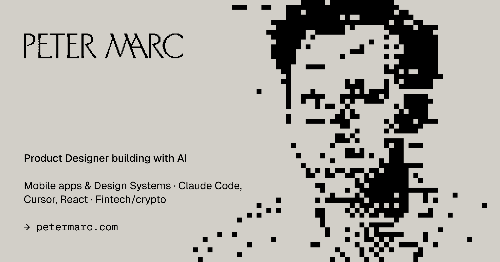

<div align="center">



</div>

```ascii
╔═══════════════════════════════════════════════════════════════════════╗
║                                                                       ║
║  PETER MARC — PRODUCT DESIGNER BUILDING WITH AI                      ║
║                                                                       ║
║  15 YEARS · MOBILE APPS · DESIGN SYSTEMS · FINTECH/CRYPTO            ║
║                                                                       ║
╚═══════════════════════════════════════════════════════════════════════╝
```

<br>

## ▓▓▓ CURRENT FOCUS

```
→ Building design-to-code workflows with Claude Code & Cursor
→ Creating MCP servers for design automation
→ Prototyping in React instead of Figma
→ Documenting AI-augmented design processes
```

<br>

## ▓▓▓ TECH STACK

<table>
<tr>
<td width="50%" valign="top">

**DESIGN**
```
Figma
Design Systems
Design Tokens
Accessibility (WCAG 2.1)
Prototyping
```

</td>
<td width="50%" valign="top">

**CODE**
```
React / TypeScript
Tailwind CSS / shadcn/ui
Next.js
HTML/CSS
```

</td>
</tr>
<tr>
<td width="50%" valign="top">

**AI TOOLS**
```
Claude Code
Cursor
v0
MCP Servers
Anthropic API
```

</td>
<td width="50%" valign="top">

**AUTOMATION**
```
n8n
Cloudflare Workers
Notion API
GitHub Actions
```

</td>
</tr>
</table>

<br>

## ▓▓▓ RECENT WORK

<table>
<tr>
<td width="50%">

**WOLT**  
Courier app onboarding experience

```
Challenge: 70% drop-off rate
Solution: Redesigned signup flow
Result: Reduced to 23% drop-off
```

</td>
<td width="50%">

**RAKBANK**  
Complete brand refresh

```
Scope: Mobile app, design system,
       ATM interfaces, website
Impact: 200+ components, 15+ teams
```

</td>
</tr>
<tr>
<td width="50%">

**BONKBOT (TELEMETRY)**  
Mobile trading terminal for Solana

```
Platform: Web, mobile, Telegram
Features: Real-time on-chain analytics
Domain: Crypto trading UX
```

</td>
<td width="50%">

**AGELESS**  
Design system for healthtech

```
Type: Web application
Focus: Scalable component library
Output: Design system documentation
```

</td>
</tr>
</table>

<br>

## ▓▓▓ OPEN SOURCE

Currently exploring:

- **Custom Claude Code skills** for design workflows
- **MCP servers** for Figma automation  
- **Design system templates** with AI-first documentation
- **AI workflow tools** for designers transitioning to code

<br>

## ▓▓▓ STATS

<div align="center">


</div>

<br>

## ▓▓▓ CONNECT

```
🌐  petermarc.com
💼  linkedin.com/in/petermarc
📧  Available for contract work & fractional roles
📅  Book intro call: cal.com/petermarc
```

<br>

---

<div align="center">

```
Most work is under NDA — this profile showcases tech stack & workflows.
Portfolio & case studies available at petermarc.com/portfolio
```

<sub>Last updated: April 2026</sub>

</div>
